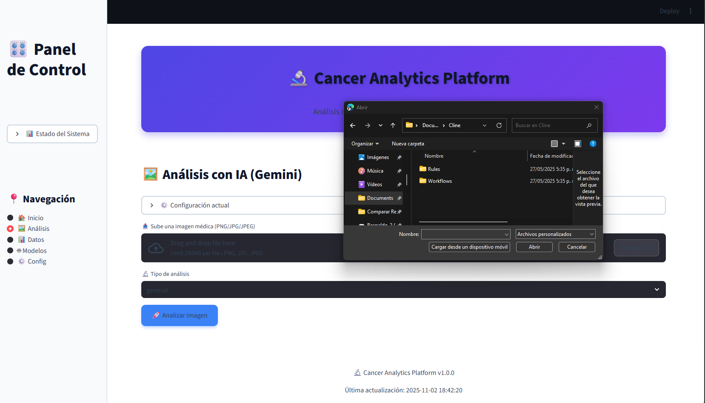
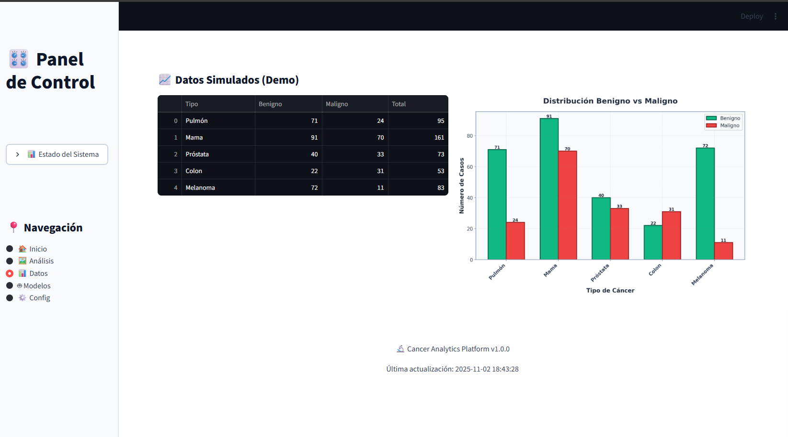
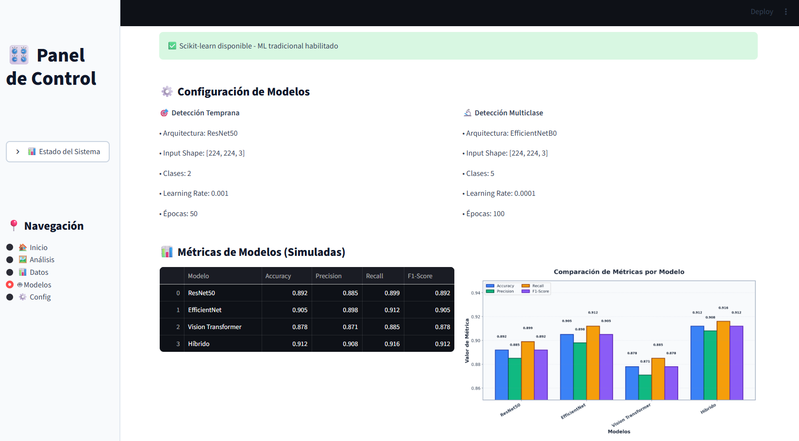

# Cancer Analytics Platform 🔬

<div align="center">


**Plataforma Integral de Análisis de Cáncer con Inteligencia Artificial**

Una completa plataforma de análisis de datos de cáncer que integra técnicas avanzadas de inteligencia artificial, análisis radiómico y procesamiento de imágenes médicas para el diagnóstico temprano y análisis detallado de diferentes tipos de cáncer.

[Características](#-características-principales) •
[Instalación](#-instalación-y-configuración) •
[Uso](#-uso-de-la-plataforma) •
[Arquitectura](#️-arquitectura-del-proyecto) •
[Documentación](#-componentes-principales)

</div>

---

## 📸 Capturas del Dashboard

<div align="center">

### Vista Principal del Dashboard


*Dashboard interactivo con navegación intuitiva y visualizaciones en tiempo real*

<br/>

### Análisis con Modelos de IA


*Comparación de múltiples arquitecturas de Deep Learning con métricas detalladas*

<br/>

### Análisis Radiómico y Visualizaciones


*Análisis cuantitativo con extracción de características radiómicas y gráficos interactivos*

</div>

---

## 🎯 Características Principales

<table>
<tr>
<td width="50%">

### 🤖 Inteligencia Artificial
- **IA Generativa**: Integración con Google Gemini AI
- **Deep Learning**: CNN, ResNet, EfficientNet, Vision Transformers
- **Modelos Híbridos**: Fusión de arquitecturas para mejor rendimiento
- **Análisis Multimodal**: Imagen + características radiómicas

</td>
<td width="50%">

### 📊 Procesamiento de Datos
- **Integración TCIA**: Acceso a The Cancer Imaging Archive
- **Análisis Radiómico**: PyRadiomics para características cuantitativas
- **DICOM Processing**: Manejo profesional de imágenes médicas
- **Pipelines E2E**: Flujos automatizados de ingesta a entrenamiento

</td>
</tr>
<tr>
<td width="50%">

### 🎨 Interfaces
- **Dashboard Streamlit**: UI/UX optimizada con alto contraste
- **Notebooks Jupyter**: Análisis exploratorio interactivo
- **CLI**: Interfaz de línea de comandos para automatización
- **API Programática**: Uso desde código Python

</td>
<td width="50%">

### 🏗️ Arquitectura
- **Hexagonal (Puertos y Adaptadores)**: Desacoplamiento limpio
- **Dependency Injection**: Container para gestión de dependencias
- **Tests Unitarios**: 9+ tests con cobertura de servicios y adaptadores
- **Configuración Centralizada**: Sistema flexible con config.json

</td>
</tr>
</table>

---

### 🏗️ Arquitectura del Proyecto

El proyecto implementa **arquitectura hexagonal** (puertos y adaptadores) para separar la lógica de negocio de las implementaciones técnicas. Ver documentación detallada en [`docs/ARCHITECTURE_HEXAGONAL.md`](./docs/ARCHITECTURE_HEXAGONAL.md).

```
cancer/
├── config/                      # 🔧 Configuraciones
│   └── config.json             #    Configuración centralizada
├── docs/                        # 📚 Documentación técnica
│   ├── ARCHITECTURE_HEXAGONAL.md  # Diseño de arquitectura
│   └── plan_proyecto.md           # Plan y requisitos
├── img/                         # 🖼️ Imágenes del README
│   ├── dashboard-home.png
│   ├── dashboard-models.png
│   └── dashboard-analysis.png
├── src/                         # 💻 Código fuente
│   ├── domain/                  # 🏛️ Entidades del dominio (core)
│   ├── ports/                   # 🔌 Interfaces/contratos
│   ├── application/             # 📦 Servicios de aplicación
│   ├── infrastructure/          # 🏗️ Adaptadores e implementaciones
│   │   ├── adapters/            #    Adaptadores de puertos
│   │   └── container.py         #    Dependency Injection Container
│   ├── utils/                   # 🛠️ Utilidades
│   │   ├── tcia_client.py       #    Cliente TCIA
│   │   ├── gemini_analyzer.py   #    Analizador Gemini AI
│   │   ├── dicom_processor.py   #    Procesador DICOM
│   │   └── config_loader.py     #    Cargador de configuración
│   ├── models/                  # 🧠 Modelos de Deep Learning
│   │   └── cancer_detection.py  #    CNN, ResNet, ViT, híbridos
│   ├── analysis/                # 🔬 Análisis avanzado
│   │   └── radiomics_analysis.py # Extracción de features radiómicas
│   ├── pipelines/               # 🔄 Pipelines E2E
│   │   ├── tcia_ingest.py       #    Ingesta desde TCIA
│   │   ├── extract_radiomics.py #    Extracción de características
│   │   ├── nsclc_prepare.py     #    Pipeline NSCLC completo
│   │   └── train_fusion.py      #    Entrenamiento multimodal
│   ├── cli/                     # ⌨️ Interfaz de línea de comandos
│   └── dashboard/               # 🎨 Dashboard web
│       ├── simple_dashboard.py  #    Aplicación Streamlit
│       └── container_loader.py  #    Loader sin imports relativos
├── notebooks/                   # 📓 Notebooks Jupyter
│   ├── 01_exploratory_data_analysis.ipynb
│   ├── 02_radiomics_analysis.ipynb
│   └── 03_model_training.ipynb
├── results/                     # 📊 Resultados y artefactos
│   ├── models/                  #    Modelos entrenados (.h5)
│   ├── reports/                 #    Reportes JSON
│   └── visualizations/          #    Gráficos y figuras
├── data/                       # Datos
│   ├── raw/                    # Datos crudos
│   ├── processed/              # Datos procesados
│   └── external/               # Datos externos
├── tests/                      # Tests unitarios
│   ├── test_domain.py
│   ├── test_analysis_service.py
│   └── test_adapters.py
└── requirements.txt            # Dependencias
```

**📚 Documentación adicional**:
- 🏗️ [Arquitectura Hexagonal](./docs/ARCHITECTURE_HEXAGONAL.md) - Diseño, capas, flujos y extensibilidad
- 📋 [Plan del Proyecto](./docs/plan_proyecto.md) - Requisitos y alcance

### 🚀 Instalación y Configuración

#### 1. Clonar el Repositorio

```powershell
# Windows PowerShell
git clone <repository-url>
Set-Location .\medical-study\cancer
```

#### 2. Crear Entorno Virtual

```powershell
# Windows PowerShell
py -m venv .venv
.\.venv\Scripts\Activate.ps1
```

#### 3. Instalar Dependencias

```powershell
pip install -r requirements.txt
# Dev tools (opcional)
pip install -r requirements-dev.txt
# Extras (opcionales: radiómica avanzada, cache de requests)
pip install -r requirements-extras.txt
```

#### 4. Configurar API Keys y entorno

Recomendado: usa variables de entorno (o `.env`) para no exponer la API key.

```powershell
# Windows PowerShell (solo para esta sesión)
\.\.venv\Scripts\Activate.ps1
$env:GEMINI_API_KEY = "TU_API_KEY_AQUI"
$env:LOG_LEVEL = "INFO"

# Opcional: archivo .env en la carpeta cancer/
Copy-Item .env.example .env
# Edita .env y agrega tu GEMINI_API_KEY
```

Alternativamente, edita `config/config.json` y coloca la API key (menos seguro):

```json
{
   "gemini": {
      "api_key": "TU_API_KEY_AQUI",
      "model": "gemini-pro-vision",
      "temperature": 0.1,
      "max_tokens": 1000
   }
}
```

### 🔧 Uso de la Plataforma

#### Opción 1 (recomendada): Flujo con datos reales (NSCLC)

1) Preparar CSV clínico externo (no se descarga automáticamente). Ubícalo en `data/external/nsclc_clinical.csv` con al menos:
    - `PatientID`
    - `Histology` (o la columna que quieras usar como etiqueta)

2) Ejecutar preparación E2E (descarga TCIA → DICOM→PNG → merge clínico → radiomics 2D → CSV final):

```powershell
.\.venv\Scripts\Activate.ps1
python -m src.pipelines.nsclc_prepare --collection NSCLC-Radiomics --modality CT `
   --max-patients 5 --max-series 2 `
   --clinical-csv data/external/nsclc_clinical.csv --clinical-id-col PatientID --label-col Histology `
   --out-dir data/processed/nsclc
```

3) Entrena el modelo multimodal (usando imagen + features 2D extraídos):

```powershell
python -m src.pipelines.train_fusion --labels_csv data/processed/nsclc/train_nsclc.csv `
   --image_col filepath --label_col label --epochs 15 --k_folds 5
```

4) Ejecuta el dashboard:

```powershell
streamlit run .\src\dashboard\simple_dashboard.py
```

#### Perfiles CLI

Para acelerar desarrollo y reducir costos, usa el perfil `dev` en la CLI:

```powershell
python -m src.cli.analyze .\path\to\image.png --type general --profile dev
```

Perfil `dev`:
- Activa `GEMINI_DRY_RUN=1` (no llama API real)
- Setea `LOG_LEVEL=DEBUG`

Perfil `prod` (por defecto si no se especifica) usa configuración normal.

### Ahorro de costos: DRY-RUN y Cache

- Gemini Dry-Run (no llama API, útil para desarrollo):
   - Configura en `config/config.json` → `gemini.dry_run: true` o usa `GEMINI_DRY_RUN=1`.
- Cache TCIA (reduce llamadas HTTP y latencia):
   - Activa en `tcia.cache.enabled: true`, ajusta `ttl_seconds` y `name`.

#### Dashboard Web

Ejecutar la aplicación Streamlit:

```powershell
streamlit run .\src\dashboard\simple_dashboard.py
```

El dashboard incluye:
- **🏠 Inicio**: Vista general del proyecto
- **🧠 Análisis**: Subir imagen y generar análisis con Gemini (dry-run disponible)

#### Notebooks Jupyter

1. **Análisis Exploratorio**:
   ```powershell
   jupyter notebook .\notebooks\01_exploratory_data_analysis.ipynb
   ```

2. **Análisis Radiómico**:
   ```powershell
   jupyter notebook .\notebooks\02_radiomics_analysis.ipynb
   ```

3. **Entrenamiento de Modelos**:
   ```powershell
   jupyter notebook .\notebooks\03_model_training.ipynb
   ```

   ### 🧰 Pipelines disponibles

   - `python -m src.pipelines.tcia_ingest` — Descarga y procesa DICOM de una colección TCIA, genera `labels.csv` con metadatos y opcional `label` desde un campo.
   - Flags nuevos: `--workers` para procesamiento paralelo de series.
   - `python -m src.pipelines.extract_radiomics` — Extrae features 2D (fallback) desde un CSV con `filepath` (mergea al vuelo si deseas).
   - `python -m src.pipelines.nsclc_prepare` — Orquesta ingesta TCIA + merge con CSV clínico + extracción de features → genera `train_nsclc.csv` listo para entrenar.
   - Genera también `metrics.json` con timings y conteos.
   - `python -m src.pipelines.train_fusion` — Entrenamiento K-Fold del modelo multimodal; crea artefactos `.h5` + `training_summary.json` en `results/models/`.

#### Uso Programático

```python
from src.utils.tcia_client import TCIAClient
from src.utils.gemini_analyzer import GeminiAnalyzer
from src.models.cancer_detection import CancerDetectionModel

# Cliente TCIA
client = TCIAClient()
collections = client.get_collection_values()

# Análisis con Gemini
analyzer = GeminiAnalyzer()
result = analyzer.analyze_medical_image('path/to/image.png')

# Modelo de detección
model = CancerDetectionModel()
model.train_model(train_data, val_data)
```

### 📚 Componentes Principales

#### 🔗 TCIA Client (`src/utils/tcia_client.py`)
- Descarga de colecciones de imágenes médicas
- Obtención de metadatos de pacientes y series
- Estadísticas de colecciones
- Manejo de errores y límites de tasa

#### 🤖 Gemini Analyzer (`src/utils/gemini_analyzer.py`)
- Análisis cualitativo de imágenes médicas
- Integración con Google Gemini API
- Procesamiento por lotes
- Generación de reportes detallados

#### 🖼️ DICOM Processor (`src/utils/dicom_processor.py`)
- Procesamiento de imágenes DICOM
- Normalización y mejora de imágenes
- Extracción de metadatos médicos
- Conversión de formatos

#### 🧠 Cancer Detection (`src/models/cancer_detection.py`)
- Modelos CNN (ResNet50, EfficientNet)
- Vision Transformers (ViT)
- Modelos híbridos CNN+ViT
- Entrenamiento y evaluación automatizada

#### 🔬 Radiomics Analysis (`src/analysis/radiomics_analysis.py`)
- Extracción de características radiómicas
- Análisis estadístico avanzado
- Clustering y reducción dimensional
- Integración con PyRadiomics

### 📊 Datasets Soportados

La plataforma soporta múltiples colecciones de TCIA:

- **CMB-LCA**: Carcinoma de pulmón
- **CMB-BRCA**: Carcinoma de mama
- **CMB-CRC**: Carcinoma colorrectal
- **CMB-RCC**: Carcinoma de células renales
- **CMB-MM**: Melanoma maligno
- **CMB-HCC**: Carcinoma hepatocelular

### 🔬 Metodología de Análisis

1. **Adquisición de Datos**: Descarga automática desde TCIA
2. **Preprocesamiento**: Normalización y mejora de imágenes
3. **Extracción de Características**: 
   - Características radiómicas cuantitativas
   - Características profundas (deep features)
4. **Análisis con IA**: 
   - Modelos de deep learning
   - Análisis cualitativo con Gemini
5. **Evaluación**: Métricas de rendimiento y validación
6. **Visualización**: Dashboard interactivo y reportes

### 🛠️ Tecnologías Utilizadas

- **Python 3.8+**: Lenguaje principal
- **TensorFlow/Keras**: Deep learning
- **PyRadiomics**: Análisis radiómico
- **Streamlit**: Dashboard web
- **Plotly/Matplotlib**: Visualizaciones
- **SimpleITK**: Procesamiento de imágenes médicas
- **Google Gemini API**: IA generativa
- **Pandas/NumPy**: Análisis de datos
- **Scikit-learn**: Machine learning tradicional
- **Arquitectura Hexagonal**: Puertos y adaptadores para desacoplar lógica de negocio e infraestructura

### 📈 Métricas de Evaluación

La plataforma evalúa modelos usando:

- **Accuracy**: Precisión general
- **Precision**: Precisión por clase
- **Recall**: Sensibilidad
- **F1-Score**: Media armónica de precision y recall
- **AUC-ROC**: Área bajo la curva ROC
- **Matriz de Confusión**: Análisis detallado de errores

### 🔒 Seguridad y Privacidad

- **Configuración de API Keys**: Almacenamiento seguro de credenciales
- **Procesamiento Local**: Análisis de datos en entorno controlado
- **Anonimización**: Manejo apropiado de datos médicos
- **Logging**: Registro de actividades para auditoría
   - usa rotación de archivos configurable con `LOG_MAX_BYTES` y `LOG_BACKUP_COUNT` para evitar crecimiento ilimitado.

### 🧪 Calidad de código (pre-commit)

Instala y habilita pre-commit para mantener formato y calidad:

```powershell
pip install pre-commit
pre-commit install
# Ejecutar manualmente sobre todo el repo
pre-commit run --all-files
```

Incluye hooks: `black`, `isort`, `flake8`, y `nbQA` para notebooks.

### 🚨 Consideraciones Médicas

⚠️ **IMPORTANTE**: Esta plataforma es para fines de investigación y educación únicamente. No debe usarse para diagnóstico médico real sin validación clínica apropiada.

- Los resultados requieren validación por profesionales médicos
- Los modelos necesitan entrenamiento con datos clínicos reales
- Se requiere aprobación ética para uso con datos de pacientes reales

### 🤝 Contribución

1. Fork el repositorio
2. Crea una rama para tu feature (`git checkout -b feature/nueva-funcionalidad`)
3. Commit tus cambios (`git commit -am 'Agrega nueva funcionalidad'`)
4. Push a la rama (`git push origin feature/nueva-funcionalidad`)
5. Crea un Pull Request

### 📄 Licencia

Este proyecto está bajo la Licencia MIT. Ver `LICENSE` para más detalles.

### 📞 Soporte

Para soporte, preguntas o sugerencias:
- Crear un issue en GitHub
- Documentación en el wiki del proyecto
- Revisar los notebooks de ejemplo

### 🎯 Roadmap

#### ✅ Completado (v1.0)
- [x] Arquitectura hexagonal (puertos/adaptadores/servicios)
- [x] Integración con TCIA (TCIAClient)
- [x] Análisis con Gemini AI
- [x] Dashboard interactivo con Streamlit (página Análisis con IA)
- [x] Configuración centralizada (config.json)
- [x] Tests unitarios (dominio, servicios, adaptadores)
- [x] CLI para análisis de imágenes

#### 🚧 En progreso
- [ ] Adaptador y puerto para PHI anonymization
- [ ] Servicio de auditoría/trazabilidad
- [ ] Servicio de ingesta y curación de datos (data-ingestor, data-curator)
- [ ] Feature store multimodal

#### 📅 Futuras versiones
- [ ] **v1.1**: Integración con PACS
- [ ] **v1.2**: Modelos de segmentación automática
- [ ] **v1.3**: Análisis longitudinal y comparación temporal
- [ ] **v1.4**: API REST para inferencia
- [ ] **v1.5**: Integración con HL7 FHIR
- [ ] **v2.0**: Despliegue en la nube (AWS/Azure/GCP)

### 📚 Referencias

- The Cancer Imaging Archive (TCIA): https://www.cancerimagingarchive.net/
- PyRadiomics: https://pyradiomics.readthedocs.io/
- Google Gemini API: https://developers.generativeai.google/
- TensorFlow: https://www.tensorflow.org/
- Streamlit: https://streamlit.io/

### 📝 Nota sobre Documentación

La documentación de este proyecto fue **optimizada con apoyo de IA Generativa**, aplicando un proceso riguroso de curación para garantizar:

- ✅ **Precisión técnica**: Validación manual de todo contenido generado
- ✅ **Coherencia arquitectural**: Correspondencia exacta con código e implementación real
- ✅ **Eliminación de alucinaciones**: Filtrado de referencias incorrectas o no implementadas
- ✅ **Relevancia contextual**: Información alineada con objetivos y capacidades del proyecto

*La IA acelera la creación de contenido, el criterio experto asegura su veracidad.*

---

**Desarrollado para el avance de la investigación en análisis de cáncer con IA** 🔬